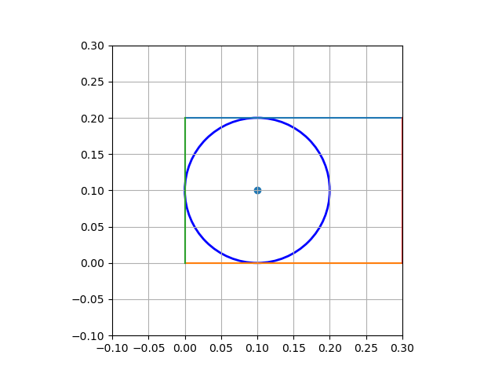
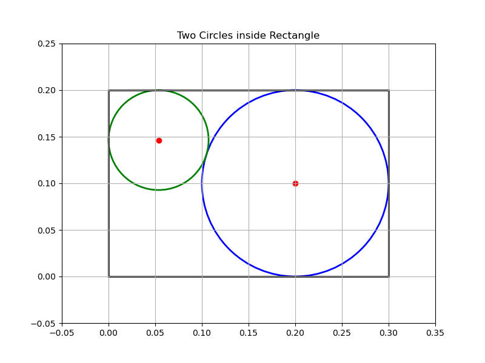
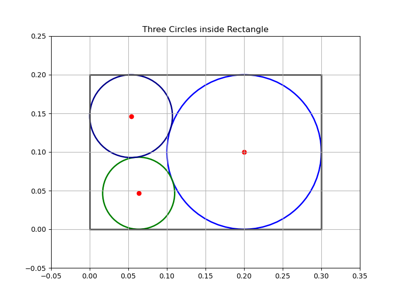
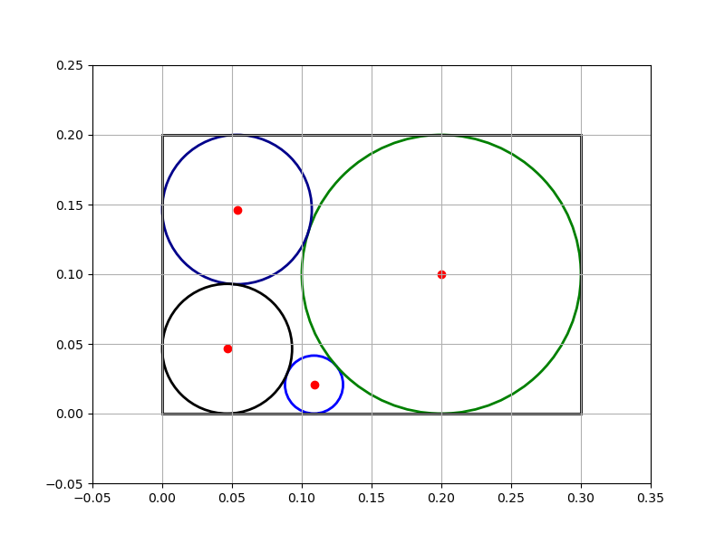

# Cutting of Circular Disks from a Rectangular Steel Plate

##  Project Description

Many industrial manufacturing processes involve cutting specific geometric shapes from a raw material. After cutting, unused material is often discarded, resulting in a loss of steel and wasted money.

This project focuses on cutting **four circular disks** with variable radii **R_1, R_2, R_3, R_4**  from a rectangular steel plate.The objective is to **minimize the waste of steel**, i.e., maximize the total area covered by the circular disks while ensuring that:

- All disks fit inside the rectangle,
- No disks overlap.

This leads to a **nonlinear constrained optimization problem**.

##  Mathematical Formulation

We want to place four circles inside a rectangle of dimensions:

- **length**:  a 
- **width**: b 

We place the origin (0,0) at the lower-left corner of the rectangle.

### **Decision variables**

For each disk i in {1,2,3,4} we denote the :

- center:  (x_i, y_i)
- radius: R_i

### **Objective**

Maximize the total area of the four disks:

min{ab-pi(R_1^2+R_2^2+R_3^2+R_4^2)}

##  Constraints

###  **1. Boundary Constraints (circle must stay inside the rectangle)**

For each circle:
R_i <= x_i <= a - R_i

R_i <= y_i <= b - R_i

These ensure that the circle does not cross any of the four borders:
 x = 0,
x = a,
 y = 0,
 y = b

### **2. Non-Overlapping Constraints**

For any two circles i and j:

d(c_i, c_j)>= R_i + R_j where d(c_i, c_j) is the distance between the circle center

##️ Method: Using GEKKO

We use the **GEKKO** Python package to solve this nonlinear constrained optimization problem.

Steps: 
- Define the rectangle dimensions a, b 
- Create GEKKO variables for centers and radii 
- Apply boundary and non-overlap constraints 
- Define objective (maximize total area) 
- Solve numerically 
- Plot the resulting configuration 

##  How to Execute the Code

Go to the folder **`notebook/`** and open the Jupyter Notebook:

waste_minimization.ipynb

Run all cells to: 
- build the optimization model, 
- solve the problem with GEKKO, 
- visualize the final layout of the four disks.

##  Example of Results a=0.30 m , b=0.20m

## Author

**Luc Agbognisso, MSc student in Mathematical Sciences at AIMS Ghana.**